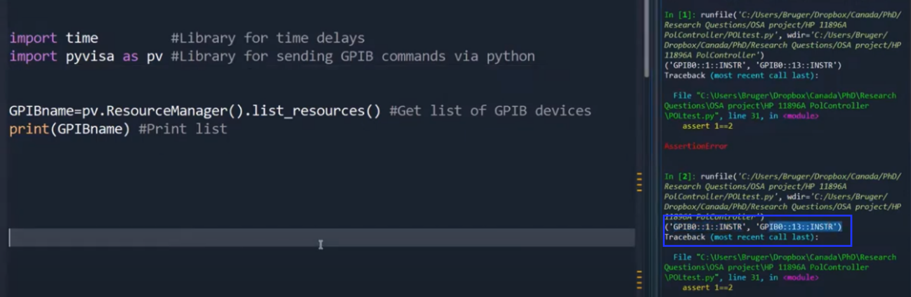

# GPIB

GPIB parece ser um tipo de interface de dados. Devo aprender a usar isso de forma a controlar o acesso e transferência de dados via arduino.

[Fundamentals of GPIB](https://www.youtube.com/watch?v=MH-srU3bPmU&pp=ygUIR1BJQiB1c2I%3D)

O barramento GPIB é feito de $24$ fios, dos quais, $8$ são aterramentos e $16$ são fios ativos.

O barramento é formado por $3$ barramentos:

* *Barramento de controle*, composto por $5$ fios;
* *Barramento de dados*, composto por $8$ fios;
* *Barramento de transferência* ou *Hand-shake bus*, formado por $3$ fios

Níveis de voltagem são compatíveis com $TTL$ (checar), padrão *negativo verdadeiro*: nível baixo representa *1 lógico* e nível alto representa *0 lógico*.

Dados enviados pelo barramento são enviados como *bit paralelo byte serial* (checar).

NÃO ENTENDI ESSA PARTE NO VÍDEO! 

> *"A sequence of 8-bit bytes with the three wire handshake bus assuring that each byte is accepted before the next is sent."*

Percebo que o barramento de dados só envia outro byte após o barramento handshake assegurar que o anterior foi recebido. Mas e essa sequência *8-bit bytes*?

Será que são 8 bits paralelos, com $1$ byte sequencial cada, enviados pelo barramento de dados por vez, com o barramento handshake verificando que eles foram enviados, para só então haver o próximo envio?

O padrão *IEEE-488*, nome intercambiável com *GPIB* e *HPIB*, define $10$ funções:

* *Source handshake*: a capacidade de conduzir uma transação byte por byte;
* *Acceptor handshake*: a capacidade de adquirir uma transação do tipo source handshake (Então, a uma transação do tipo acceptor handshake corresponde uma transação source handshake);
* *Talker*: a habilidade de *falar* no barramento - pôr bytes no barramento de dados;
* *Listener*: a capacidade de *ouvir* ou receber dados do barramento de dados - receber os bytes "falados";
* *Service request*: a habilidade de interromper o controlador, para pedir por serviço;
* *Remote-local*: a capacidade de ser posto sob controle remoto ou controle de painel frontal (UM EXEMPLO MAIS ALUSIVO SERIA INTERESSANTE AQUI);
* *Parallel pole*: a habilidade de até $8$ instrumentos dizerem simultaneamente ao controlador se eles pediram por serviço;
* *Device clearer*: a habilidade de ser inicializado para algum estado pré-estabelecido;
* *Device trigger*: a habilidade de começar alguma operação básica ao comando do controlador;
* *Controller*: a habilidade de delegar função de *listeners* e *talkers* aos aparelhos.

*Um aparelho não precisa necessariamente implementar todas essas funções para ser útil e de fato poucos deles vão fazê-lo.*

> Interrompi o vídeo aos $5:54$ minutos.

## Interface entre GPIB e microcontroladores.

Nesta seção, discutimos a interface entre barramento GPIB e microcontroladores, como o Arduino, ESP32 e mesmo plataformas computacionais como o Raspberry Pi e similares, como o Orange Pi e o Banana Pi.

[GPIB-to_USB interface with Arduino Nano UPDATE](https://www.youtube.com/watch?v=DAS1KVU_FaA)

## Controlando instrumentos GPIB via Python. 

No vídeo a seguir, [Remote GPIB control of instruments](https://www.youtube.com/watch?v=4bJGaGPRnbQ), partir dos $2:30$ minutos ele fala sobre um pacote chamado *Pyvisa*, que permite enviar comandos GPIB usando Python. Ele necessita de um adaptador, como o visto abaixo: 

<figure>
    
    <figcaption> Adaptador GPIB/USB da National Instruments.</figcaption>
</figure>

Ele usa um driver proprietário encontrado na página [National Instruments GPB-USB-HS Driver](http://www.ni.com/en-ca/support/downloads/drivers/downloads.ni-488-2.html#305442).

Retomando ao vídeo, aos $5:31$ minutos, o autor mostra como obter o endereço GPIB de alguns instrumentos de medida, como um *Controlador de Polarização* e um *Atenuador Ótico*.

<figure>
    
    <figcaption> Biblioteca Python Pyvisa acessando endereços GPIB de instrumentos de laboratório. A saída do programa foi destacada no quadrado azul, à direita.</figcaption>
</figure>

O vídeo sugere também olhar o manual de instruções dos instrumentos para verificar os comandos computacionais que podem ser emitidos via GPIB.

Eu parei aos $8:24$ no vídeo.