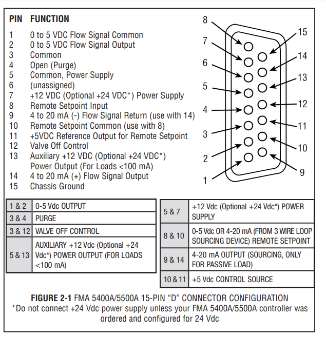
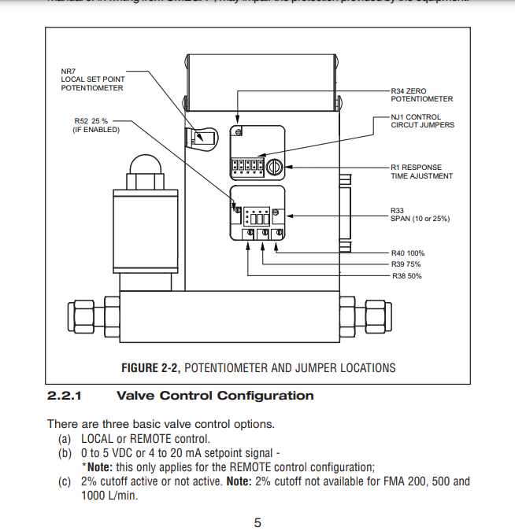
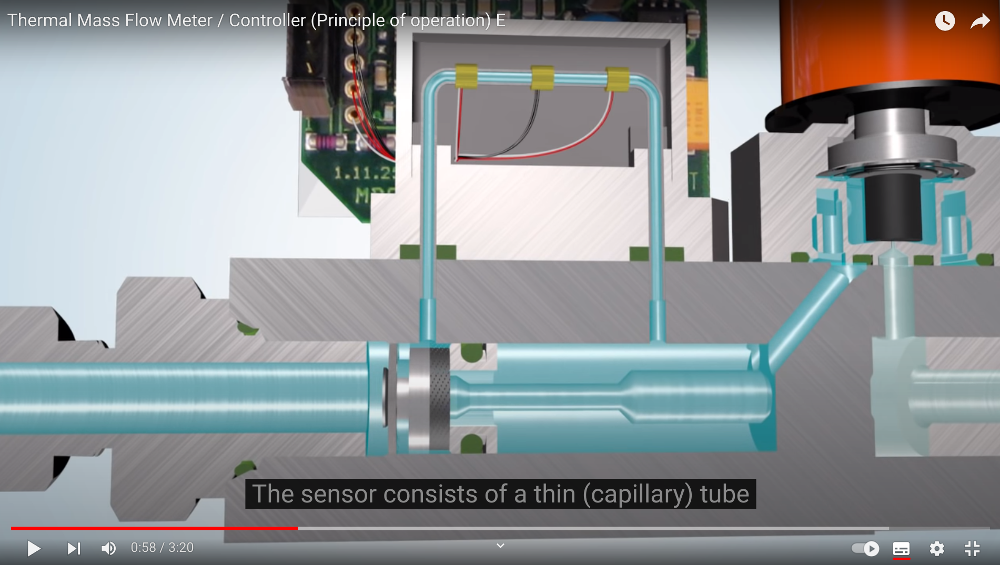
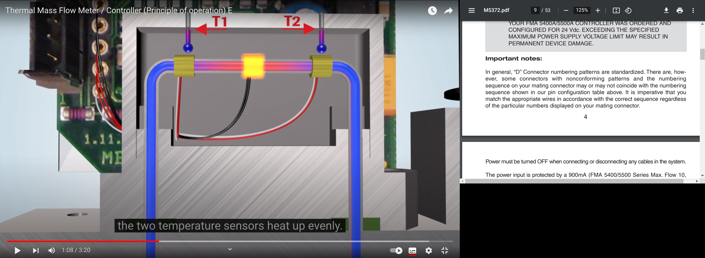
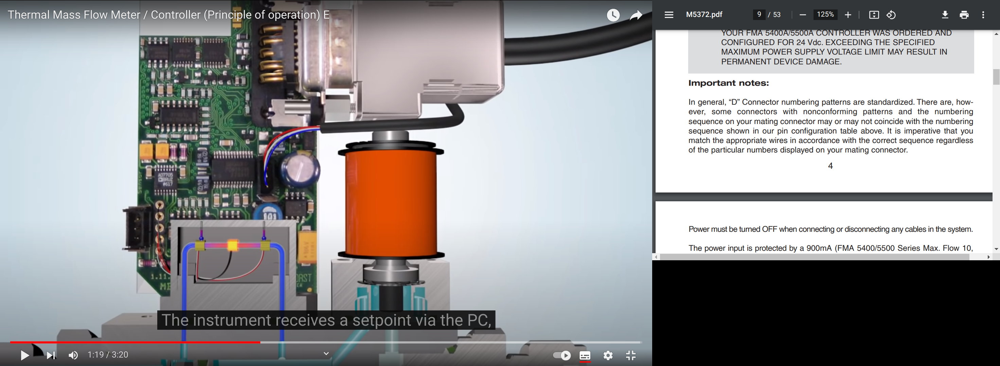

# Controladora de fluxo de massa

Neste documento, eu registrarei as nuances envolvidas na criação do sistema de automação das controladoras de fluxo de massa.

## Pulseiras de aterramento

Na página 2 do manual, segundo o fabricante da controladora de fluxo de massa FMA 5400A/5500A, é necessário a utilização de pulseira de aterramento para evitar descargas de eletricidade estática que possam danificar os circuitos CMOS da controladora. Abaixo seguem alguns links de compra das pulseiras na Amazon.

[KingWin ATS-W24YKingwin Anti Static Wrist Strap Yellow](https://www.amazon.com/dp/B01BMJ1VWS/ref=sspa_dk_detail_2?pd_rd_i=B01BMJ1VWS&pd_rd_w=p7wdp&content-id=amzn1.sym.eb7c1ac5-7c51-4df5-ba34-ca810f1f119a&pf_rd_p=eb7c1ac5-7c51-4df5-ba34-ca810f1f119a&pf_rd_r=VH3WKCJFGHRAK9SKTX0J&pd_rd_wg=nhkZa&pd_rd_r=ad80ff8d-df6d-472a-8000-f6da6510cdc0&s=electronics&sp_csd=d2lkZ2V0TmFtZT1zcF9kZXRhaWw&th=1)

[StarTech com Static Wrist Strap Grounding](https://www.amazon.com/StarTech-com-Static-Wrist-Strap-Grounding/dp/B0002QKMEG)

### Não remova proteção ESD!

Uma capa de proteção contra *Electro Static Discharge (ESD)*, descarga de eletricidade estática, é fornecida pelo fabricante, o qual não recomenda que seja retirada até que a interface do conector D de 15 pinos seja usada (página 2).

## Checar exigências de alimentação

Fabricante sugere checar a alimentação Vdc sugerida no verso da controladora e não exceder seu máximo. No caso de Vdc de 12V, não exceder os 15V, por exemplo.

## Potenciômetro SETPOINT

Um potenciômetro SETPOINT controla o fluxo localmente. Uma entrada de referência analógica entre $0$ e $5V$ (ou entre 4 e 20mA) é necessária para controlar remotamente. Parece que é isso que vamos usar para controlar via Arduino.

<figure>
    
    <figcaption> Esquemático do conector 'D' de 15 pinos.</figcaption>
</figure>

Como podemos ver no esquemático, o controle remoto do SETPOINT é feita via pino $8$ (Eu acho!!! CHECAR!) em conjunção com o pino $10$ e possivelmente o $11$.

> Pinos 8 e 10 serão usados para regular o fluxo de forma remota, via entrada variável de tensão entre $0$ e $5V$.
> É importante salientar que a pinagem do conector é em geral padronizada, mas podem haver divergências entre os modelos.

<figure>
    
    <figcaption> Configuração de controle da válvula.</figcaption>
</figure>

## Tutoriais e demonstrações no YouTube

### [Controladora de fluxo de massa IRASOL](https://www.youtube.com/watch?v=A-FLESngH40&ab_channel=IRASOL)

Explica o funcionamento do produto da IRASOL em linhas gerais. Pressão do gás é medida através de um sensor de fluxo laminar.

### [Applied Science: How a Mass Flow Controller works](https://www.youtube.com/watch?v=BfdwD1V3jNk&ab_channel=AppliedScience)
 
Explica o funcionamento geral de uma controladora de fluxo de massa em linhas gerais. No modelo descrito, a pressão do gás é medida através da capacidade de o gás transferir calor entre os dois aquecedores componentes do sensor. Portanto, um fator importante aqui é a capacidade térmica do gás utilizado e, portanto, a controladora deve ser calibrada para o gás em uso. O dono do canal usa a controladora de fluxo para alimentar um sputter.

### [Thermal Mass Flow Meter / Controller (Principle of operation) E](https://www.youtube.com/watch?v=G62ma2IFh9o&ab_channel=Bronkhorst)

O fabricante Bronkhorst descreve um medidor de fluxo de massa térmica. O sensor de pressão parece semelhante com o descrito pelo canal 
*Applied Science*, mencionado anteriormente.

A figura a seguir mostra de forma esquemática o sensor de pressão. Um aquecedor (o contato metálico do meio, conectado ao fio preto) aquece o filamento capilar, cheio de gás. Os outros dois contatos devem ser aquecidos de forma homogênea e registram a mesma temperatura,

<figure>
    
    <figcaption> Sensor térmico capilar.</figcaption>
</figure>

como é mostrado de forma pictórica na figura abaixo.

<figure>
    
    <figcaption> Sensor térmico capilar.</figcaption>
</figure>

"O valor registrado é zero". É tudo o que é dito no vídeo. Um 'setpoint' é enviado via conector D e é comparado pelo microcontrolador. Se o setpoint for maior que o valor medido, a válvula é atuada pelo microcontrolador, de forma a liberar passagem de gás à pressão determinada.

<figure>
    
    <figcaption> Sensor térmico capilar.</figcaption>
</figure>

### [Sierra Instruments: How to Configure Your 810 Mass Flow Controller Set Point](https://www.youtube.com/watch?v=w48SLhusikU&list=PLafdI4vWSvPhgizZUSAHMH238ww_9JtnC&ab_channel=SierraInstruments)

Esse vídeo é interessante, pois, apesar de se tratar de outro modelo de controladora de fluxo, é possível ver o ajuste técnico dos parâmetros. O vídeo é parte de um repertório de vídeos sobre ajustes de parâmetros do dispositivo.

### [Canal Engenhocando: CONTROLE ANALÓGICO DE TEMPERATURA - PROJETO COMPLETO](https://www.youtube.com/watch?v=1AtHVKQc35w&ab_channel=Engenhocando)

Apesar de fora do escopo deste resumo, neste canal ele apresenta um projeto de controle de dispositivo baseado em temperatura, mas trata do uso de *setpoints*, que é algo que me interessa aqui.